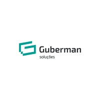
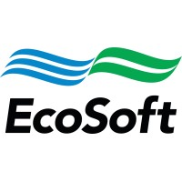
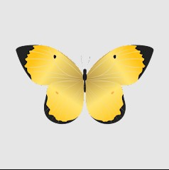
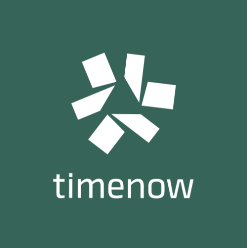

## Guberman
- *Estagiário Fullstack* | Março 2022 - Maio 2022
- 
- Tags: Empresas
- Badges:
  - Front [blue]
- List Items:
  - Frontend: .ASPNET, VUE JS;
  - Backend: C#. .NET, FoxPro;
  - Database: MYSQL;

## EcoSoft
- *Estagiário Fullstack* | Julho 2022 - Dezembro 2022
- 
- Tags: Empresas
- Badges:
  - Badge [blue]
- List Items:
  - Frontend: AngularTS;
  - Backend: NodeTS;
  - Database: PostgreSQL;

## Smart Innovation
- *Desenvolvedor FullStack* | Março 2023 - Julho 2023
- 
- Tags: Empresas
- Badges:
  - Badge [blue]
- List Items:
  - Frontend: AngularJS, ReactTS, .NET, NextJS;
  - Backend: C#, NodeTS, NestJS;
  - Database: PostgreSQL;
  - Docker;

## JS Soluction
- *Desenvolvedor Backend* | Dezembro 2023 - Fevereiro 2024
- 
- Tags: Empresas
- Badges:
  - Badge [blue]
- List Items:
  - Frontend: ReactJS, ChakraUI;
  - Backend: NodeJS(Typescript), Python;
  - Database: PostgreSQL;
  - Docker;

## EMPFO App
- *Desenvolvedor Backend* | Agosto 2023 - Dezembro 2024
- 
- Tags: Empresas
- Badges:
  - Badge [blue]
- List Items:
  - Frontend: React Native(Expo GO);
  - Backend: NodeJS(Typescript);
  - Database: PostgreSQL;    
  - Docker;

## Prefeitura Municipal Campos Dos Goytacazes
- *Desenvolvedor Fullsack* | Julho 2024- Janeiro 2025
- 
- Tags: Empresas
- Badges:
  - Badge [blue]
- List Items:
  - Frontend: ReactJS;
  - Backend: NodeJS(Typescript);
  - Database: PostgreSQL;    
  - Docker;  
  
## TimeNow (Fullstack)
- *Desenvolvedor Fullstack* | Abril 2024 - Fevereiro 2025
- 
- Tags: Empresas
- Badges:
  - Badge [blue]
- List Items:
  - Frontend: ReactJS, ChakraUI, AngularJS;
  - Backend: NodeJS(Typescript), Docker, Python, C#;
  - Database: PostgreSQL, SQL; 
  - Docker;

## Inbazz (Fullstack)
- *Desenvolvedor Fullstack* | Maio 2025 - Atual
- 
- Tags: Empresas
- Badges:
  - Badge [blue]
- List Items:
  - Frontend Mobile: React-Native, FlutterFlow;
  - Backend: NestJS, Supabase;
  - Database: PostgreSQL, SQL; 
  
